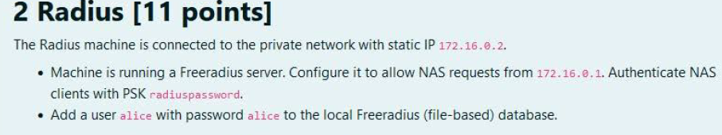

# 1 Gateway Network Log

1. **BASICS: Gateway Network Setup**
    - Create the main virtual machine and install necessary packages. 
    - **Disable IPv6**
      
      Start the image and login as isp/isp.

      ```sh
      sudo nano /etc/sysctl.conf
      ```
      
      Add the following lines at the end of the file:
      ```sh
      net.ipv6.conf.all.disable_ipv6 = 1
      net.ipv6.conf.default.disable_ipv6 = 1
      net.ipv6.conf.lo.disable_ipv6 = 1
      ```

      Activate changes by running:
      ```sh
      sudo sysctl -p
      ```

      To verify that IPv6 has been disabled, run:
      ```sh
      cat /proc/sys/net/ipv6/conf/all/disable_ipv6
      ```
      This should output `1`.


    - **VPN StrongSwan:**
      ```sh
      sudo apt update
      sudo apt install strongswan strongswan-pki libcharon-extra-plugins apache2 wireshark net-tools
      ```
    - **AAA with Free RADIUS:**
      ```sh
      sudo apt update
      sudo apt install freeradius freeradius-utils apache2 libapache2-mod-auth-radius wireshark
      ```
    - Create a new NAT in VirtualBox -> tools -> network -> NAT Networks named `nat_midterm`
    - clone the VM and name it ```RADIUS```, ```RW_Alice``` and ```Gateway```.
    - On the ```Gateway``` VM, set the first adapter to NAT Network `nat_midterm` and the second adapter to internal network `int_net`.
    - On ```RW_Alice```, set the first adapter to NAT Network  `nat_midterm` 
    - On ```RADIUS```, set the first adapter to internal network `int_net`.
   


2. **Network Configuration**
    - On RADIUS:
    
      terminal
        ```sh
        sudo nano /etc/netplan/01-network-manager-all.yaml
        ```
      add to file
      ```
      network:
         version: 2
         ethernets:
            enp0s3:
              addresses: [172.16.0.2/24]
              gateway4: 172.16.0.1
      ```
      terminal
      ```
      sudo netplan apply
      ```
    - On Gateway:
      ```sh
      echo 1 | sudo tee /proc/sys/net/ipv4/ip_forward
      sudo nano /etc/netplan/01-network-manager-all.yaml
      ```

      ```
      network:
         version: 2
         ethernets:
            enp0s3:
              addresses: [10.0.2.0/24]
            enp0s8:
              addresses: [172.16.0.1/24]
      ```
      ```sh
      sudo iptables -t nat -A POSTROUTING -o enp0s3 -j MASQUERADE
      sudo netplan apply
      ```
    - Verify connectivity:
      - Ping from Gateway to RADIUS and vice versa ```ip addr```
      - Ping from RADIUS to Google.

3. **RW Alice Configuration**

    ```sh
    sudo nano /etc/netplan/01-network-manager-all.yaml
    network:
      version: 2
      ethernets:
         enp0s3:
            dhcp4: true
            dhcp-identifier: mac
         enp0s8:
            addresses: [172.16.1.0/24]
    sudo netplan apply
    ```


# 2 RADIUS Log

1. **Add RADIUS Client**
    ```sh
    sudo nano /etc/freeradius/3.0/clients.conf
    client Gateway {
      ipaddr = 172.16.0.1
      secret = radiuspassword
      require_message_authenticator = no
      nas_type = other
    }
    ```

2. **Add User Alice**
    ```sh
    sudo nano /etc/freeradius/3.0/users
    "alice" Cleartext-Password := "alice"
    ```

# 3 Gateway Firewall Log

1. **Configure Firewall Rules**

  ```git clone https://github.com/lem-course/isp-iptables.git``` open file handson-tables ->
  write the rules in the file under ```d_start() {```  paste


  ```sh
  #for nat
  iptables -t nat -A POSTROUTING -o enp0s3 -j MASQUERADE
  # stateful firewall
  iptables -A INPUT -m state --state ESTABLISHED,RELATED -j ACCEPT
  iptables -A OUTPUT -m state --state ESTABLISHED,RELATED -j ACCEPT
  #allow all routed traffic to pass through
  iptables -A FORWARD -m state --state NEW,ESTABLISHED,RELATED -j ACCEPT
  #outgoing ping
  iptables -A OUTPUT -p icmp -m state --state NEW -j ACCEPT
  #incoming ping
  iptables -A INPUT -p icmp -m state --state NEW -j ACCEPT
  #dns outgoing
  iptables -A OUTPUT -p udp --dport 53 -m state --state NEW -j ACCEPT
  #ISAKMP incoming
  iptables -A INPUT -p udp --dport 500 -m state --state NEW -j ACCEPT
  #IPsec (ESP) incoming
  iptables -A INPUT -p esp -m state --state NEW -j ACCEPT
  #NAT-T
  iptables -A INPUT -p udp --dport 4500 -m state --state NEW -j ACCEPT
  ```

# 4 Gateway VPN Log

1. **Configure VPN on Gateway**
    ```sh
    sudo nano /etc/ipsec.conf
    config setup
    conn %default
      ikelifetime=60m
      keylife=20m
      rekeymargin=3m
      keyingtries=1
      keyexchange=ikev2
      authby=secret
    conn VPN
      leftsubnet=172.16.0.0/24
      leftfirewall=yes
      leftid=gw
      right=%any
      rightsourceip=172.16.1.0/24
      auto=add
    sudo ipsec restart
    ```

2. **Configure VPN on RW Alice**
    ```sh
    sudo nano /etc/ipsec.conf
    config setup
    conn %default
      ikelifetime=60m
      keylife=20m
      rekeymargin=3m
      keyingtries=1
      keyexchange=ikev2
      authby=secret
    conn net-net
      leftsubnet=10.2.0.0/24
      leftid=%any
      leftfirewall=yes
      right=10.0.2.5
      rightsubnet=10.0.2.0/24
      rightid=gw
      auto=add
    sudo ipsec restart
    ```

3. **Add PSK on Gateway AND RW Alice**
  ```sh
  sudo nano /etc/ipsec.secrets
  @gw: PSK "mypsk"
  sudo ipsec restart
  ```

# 5 RoadWarrior Log


1. **Configure Network on RoadWarrior**
  ```sh
  sudo nano /etc/netplan/01-network-manager-all.yaml
  network:
    version: 2
    ethernets:
    enp0s3:
      dhcp4: true
      dhcp-identifier: mac
  sudo netplan apply
  ```

2. **Configure VPN on RoadWarrior**
  ```sh
  sudo nano /etc/ipsec.conf
  config setup

  conn %default
    ikelifetime=60m
    keylife=20m
    rekeymargin=3m
    keyingtries=1
    keyexchange=ikev2
    authby=secret

  conn VPN
    leftsubnet=0.0.0.0/0          # RW accesses all remote networks
    leftid=alice                  # RW identity
    leftfirewall=yes
    right=10.0.2.0/24             # Correct Gateway Public IP
    rightsubnet=172.16.0.0/24,172.16.1.8/24  # Access to company network and other RWs
    rightid=gw                    # Gateway identity
    auto=add
  sudo ipsec restart
  ```
